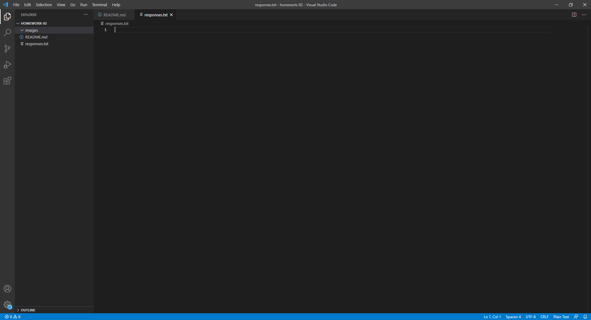

# Assignment 2
## Julien Dousset

I decided to take this class because it seems interesting and it is required for my major.

- I learned the different ways in which the internet sends data
- I learned about DNS
- I want to learn how to make better website designs

[Web Design Website](https://intro-web-dev.media-ed-online.com/topic-02/overview/)

[My Response File](./responses.txt)

