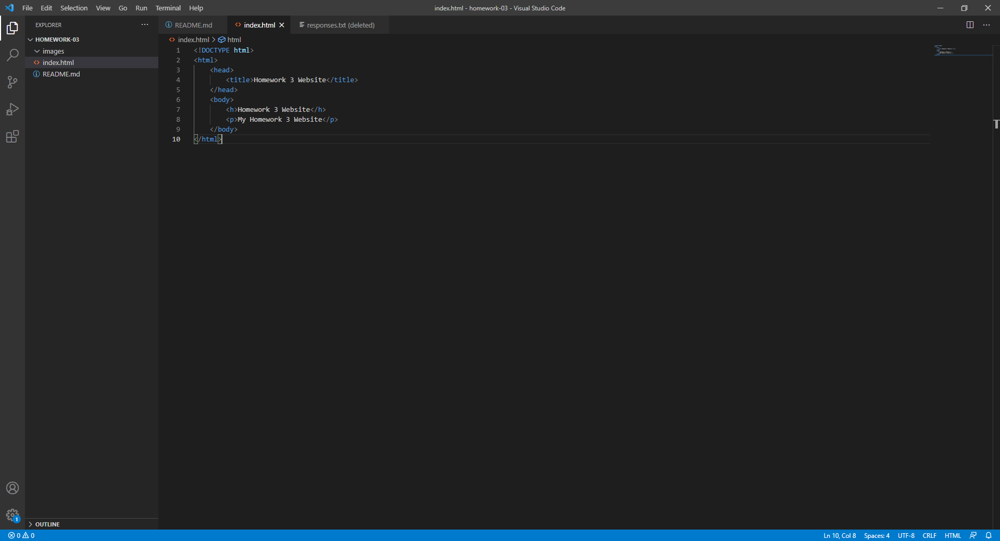

# Assignment 3
## Julien Dousset

Browsers use engines to interpret the HTML, CSS, Javascript etc. I use Chrome.

A markup language is used to determine how things look and are displayed on a screen

