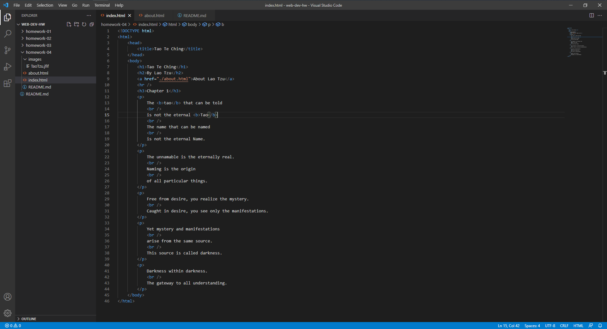

# Homework 4

I went to http://www.umt.edu/ on August 30th 2005.
It looks a lot different than what it looks like right now.
They both have a top bar to navigate the website, however,
now its a lot cleaner with less clutter over the screen, and
smooth animations for drop downs etc. Also elements of the website
right now take up the entire screen however on the old website
a lot of the elements of the website are in the middle.

The Git Module was great and easy to use.

