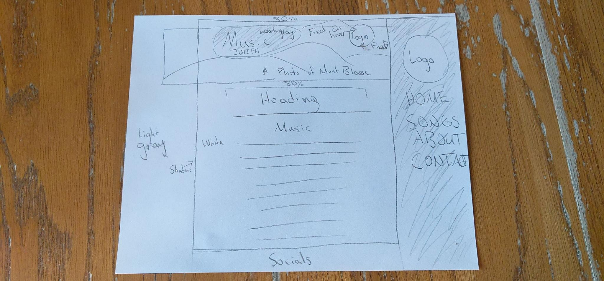

# Homework 11

1. Margin is the distance between an element form another element, borders border an element on a page, and padding determines how much space there is from an element to the border of the element on the page.

2. 

3. First I looked at the instructions, and then I watched the example video. Afterwards, I went through the assignment website. Then I started outlining the website and designing it in HTML and CSS, and referred to the assignment website whenever I needed to. I did the project a little backwards, and drew the outline after designing a lot of it through HTML and CSS. Once I got the drawn outline, I added more detail to the website, and I did that until I got my website to where I wanted it.